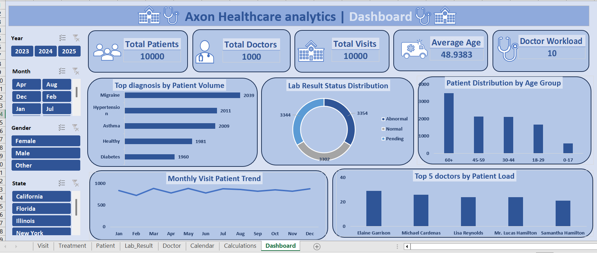
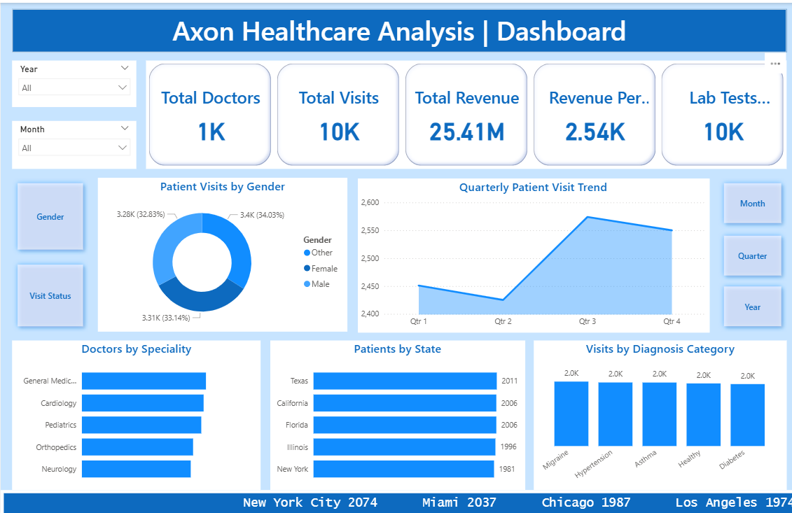
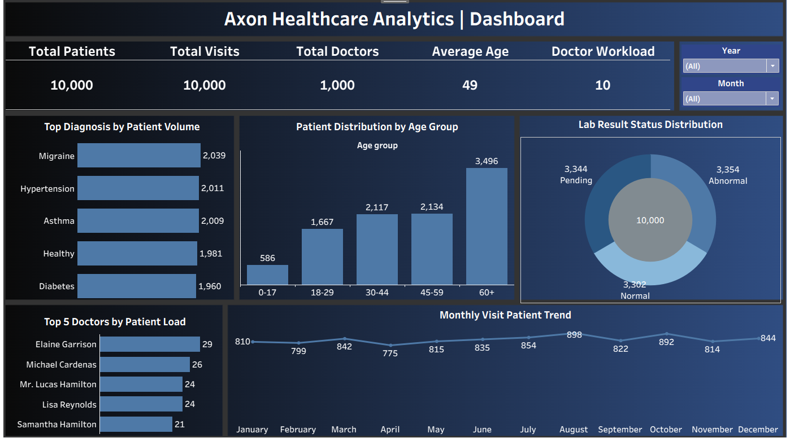

# 🏥 Axon Healthcare Analysis

### Healthcare Data Analytics Dashboard (Excel | SQL | Power BI | Tableau)

---

# 📌 Project Overview

The **Axon Healthcare Analysis** project focuses on analyzing healthcare data to uncover insights about **patient trends, treatment costs, hospital performance, and departmental efficiency**.

Using **Excel, SQL, Power BI, and Tableau**, the project transforms raw healthcare data into **interactive dashboards** that help stakeholders make **data-driven decisions in the healthcare sector**.

This project demonstrates **end-to-end data analytics**, including:

* Data Cleaning
* Data Transformation
* Data Analysis
* Data Visualization

---

# 🛠 Tools & Technologies

* **Microsoft Excel** – Data cleaning and exploratory analysis
* **Power Query** – Data transformation (ETL process)
* **SQL** – Data extraction and analytical queries
* **Power BI** – Interactive dashboards and KPI tracking
* **Tableau** – Visual storytelling and advanced visualization

---

# 📂 Dataset Description

The dataset contains **healthcare operational data**, including:

* **Patients** – Patient demographic information
* **Doctors** – Doctor details and specializations
* **Visits** – Patient visit records
* **Treatments** – Treatment details provided during visits
* **Lab Results** – Diagnostic test results

These datasets are connected through **relationships in the data model** to enable integrated analysis.

---

# 🔧 Data Cleaning & Transformation

Data preprocessing was performed using **Excel and Power Query**.

Key steps included:

* Data cleaning and formatting
* Handling missing values
* Removing duplicate records
* Standardizing column names
* Creating structured tables for analysis

---

# 📊 Data Modeling

Using **Power Pivot**, the following relationships were created:

* **Patients → Visits**
* **Doctors → Visits**
* **Visits → Treatments**
* **Visits → Lab Results**

This relational data model enables **efficient data analysis and KPI calculations**.

---

# 📊 Key KPIs

The dashboard tracks the following performance metrics:

* Total Patients Treated
* Average Treatment Cost
* Average Length of Stay
* Department-wise Patient Count
* Total Revenue Generated
* Treatment Distribution by Department

---

# 📈 Dashboard Visualizations

The dashboards include:

* Patient Distribution by Department
* Treatment Cost Analysis
* Average Length of Stay Analysis
* Department Performance Comparison
* Patient Admission Trends Over Time
* Revenue Generated by Department

---

# ⚡ Interactive Features

Interactive dashboards allow filtering by:

* Department
* Treatment Type
* Time Period
* Patient Demographics

This enables stakeholders to **explore trends dynamically**.

---

# 💡 Key Insights

### 1️⃣ Department Performance

Some departments handle significantly higher patient volumes.

**Recommendation:**
Allocate resources accordingly to improve operational efficiency.

---

### 2️⃣ Treatment Cost Trends

Certain treatments have higher average costs.

**Recommendation:**
Monitor high-cost treatments to optimize hospital expenses.

---

### 3️⃣ Patient Stay Duration

Longer patient stays impact hospital capacity.

**Recommendation:**
Improve treatment workflows to reduce average stay duration.

---

### 4️⃣ Admission Trends

Patient admissions fluctuate across months.

**Recommendation:**
Plan staffing levels based on seasonal admission patterns.

---

# 📊 Dashboard Preview

### Excel Dashboard

### Power BI Dashboard

### Tableau Dashboard

---

# 🎯 Conclusion

This project demonstrates how **data analytics can improve healthcare decision-making** by identifying patterns in patient data, treatment costs, and departmental performance.

Using analytics tools and dashboards, hospitals can **optimize operations, improve patient care, and make better strategic decisions**.

---

# 👩‍💻 Author

**Apeksha Sonawane**
Aspiring **Data Analyst**

**Skills**
SQL • Excel • Tableau • Power BI • Data Visualization

⭐ If you find this project helpful, consider **starring the repository**!

---

